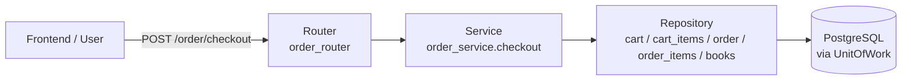

# Checkout Flow — Flow & Logic Notes

> Architecture and processing flow notes for the checkout module of the Book Management project.
> Covers creating an order from the cart (stock validation, order/order-items creation, stock decrement, cart clearing), plus the expired-order rollback job.

---

## 1. Architecture Overview

One-directional pipeline, each layer has one responsibility:

### Core principles

- `order_router` is the **only** HTTP entry point for checkout.
- `order_service.checkout` owns all business validation and database updates; it never touches HTTP details.
- All changes for one checkout run inside a single **UnitOfWork** (auto-commit on success, auto-rollback on error) — creating the order, creating order items, decrementing stock, and clearing the cart are **atomic**.
- Stock is read with a **row lock** (`books.get_by_id_for_update`) to prevent overselling when two users check out the same book concurrently.
- The created order starts as `PENDING` with an `expires_at` deadline — this is the input to the payment flow (`payment_flow.md`).
- The service only works with **cart/order aggregates** — repositories handle the raw SQL/SQLAlchemy queries.
