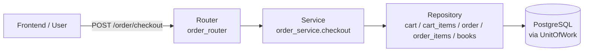
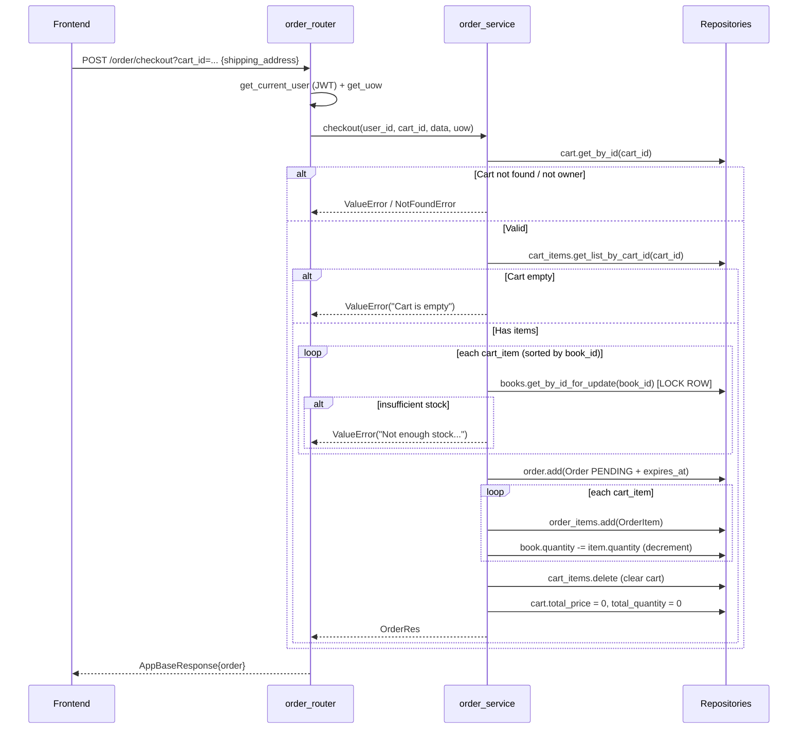

# Checkout Flow — Flow & Logic Notes

> Architecture and processing flow notes for the checkout module of the Book Management project.
> Covers creating an order from the cart (stock validation, order/order-items creation, stock decrement, cart clearing), plus the expired-order rollback job.

---

## 1. Architecture Overview

One-directional pipeline, each layer has one responsibility:


```mermaid
flowchart LR
    FE["Frontend / User"] -->|"POST /order/checkout"| RT["Router<br/>order_router"]
    RT --> SV["Service<br/>order_service.checkout"]
    SV --> RP["Repository<br/>cart / cart_items / order / order_items / books"]
    RP --> DB[("PostgreSQL<br/>via UnitOfWork")]
```

### Core principles

- `order_router` is the **only** HTTP entry point for checkout.
- `order_service.checkout` owns all business validation and database updates; it never touches HTTP details.
- All changes for one checkout run inside a single **UnitOfWork** (auto-commit on success, auto-rollback on error) — creating the order, creating order items, decrementing stock, and clearing the cart are **atomic**.
- Stock is read with a **row lock** (`books.get_by_id_for_update`) to prevent overselling when two users check out the same book concurrently.
- The created order starts as `PENDING` with an `expires_at` deadline — this is the input to the payment flow (`payment_flow.md`).
- The service only works with **cart/order aggregates** — repositories handle the raw SQL/SQLAlchemy queries.

---

## 2. File Map

Ordered top-down, following the request path:

| Layer | File | Role |
|---|---|---|
| Router | `app/routers/order_router.py` | HTTP entry: `POST /order/checkout` |
| Dep | `app/api/deps.py` | `get_current_user` dependency — decodes JWT, returns `User` |
| Service | `app/services/order_service.py` | Business logic: `checkout`, `cancel_expired_orders` |
|  | `app/services/cart_service.py` | `restore_order_items_to_cart` — restore cart after rollback |
| Job | `app/jobs/order_jobs.py` | `run_cancel_expired_orders_job` — scheduled every 30s |
| Repository | `app/repositories/cart_repository.py` | `Cart` queries: `get_by_id` (inherited), `get_cart_by_user_id` |
|  | `app/repositories/cart_item_repository.py` | `CartItem` queries: `get_list_by_cart_id` (eager-loads `book`) |
|  | `app/repositories/order_repository.py` | `Order` queries: `add` (inherited), `get_expired_pending_orders` |
|  | `app/repositories/order_item_repository.py` | `OrderItem` writes: `add` (inherited) |
|  | `app/repositories/book_repository.py` | `Book` queries: `get_by_id_for_update` (row lock + stock) |
|  | `app/repositories/user_repository.py` | `User` queries: `get_by_id` (inherited) |
| Model | `app/models/cart_model.py` | ORM model `Cart` |
|  | `app/models/cart_item_model.py` | ORM model `CartItem` |
|  | `app/models/order_model.py` | ORM model `Order` (+ `order_items` relationship) |
|  | `app/models/order_item_model.py` | ORM model `OrderItem` |
|  | `app/models/book_model.py` | ORM model `Book` |
| Schema | `app/schemas/order_schema.py` | Schemas: `CreateOrderReq`, `OrderRes`, `order_to_res` |
| Enum | `app/enum/common.py` | Enums: `OrderStatus`, `PaymentStatus` |
| DB | `app/orm/unit_of_work.py` | `UnitOfWork` — one DB transaction per HTTP request |
| ORM | `app/orm/repository.py` | Generic `Repository` — `add`, `get_by_id`, `delete` |
| Config | `app/configs/config.py` | `PAYMENT_EXPIRY_MINUTES` — order payment deadline |

---

## 3. API Endpoint

| # | Method & Path | Auth | Purpose |
|---|---|---|---|
| 3.1 | `POST /order/checkout` | ✅ Bearer JWT | Checkout the cart → creates a PENDING order. |

> After checkout the order is `PENDING` with `expires_at = now + PAYMENT_EXPIRY_MINUTES`. The next step (creating a payment and paying via VNPay) is documented in [payment_flow.md](./payment_flow.md).

---

## 4. Case 1 — Checkout (success)

### Payload

```http
POST /order/checkout?cart_id=019e4b6e-... HTTP/1.1
Authorization: Bearer <access_token>
Content-Type: application/json

{"shipping_address": "123 Nguyen Hue, District 1"}
```

### Flow


```mermaid
sequenceDiagram
    participant FE as Frontend
    participant RT as order_router
    participant SV as order_service
    participant RP as Repositories

    FE->>RT: POST /order/checkout?cart_id=... {shipping_address}
    RT->>RT: get_current_user (JWT) + get_uow
    RT->>SV: checkout(user_id, cart_id, data, uow)
    SV->>RP: cart.get_by_id(cart_id)
    alt Cart not found / not owner
        SV-->>RT: ValueError / NotFoundError
    else Valid
        SV->>RP: cart_items.get_list_by_cart_id(cart_id)
        alt Cart empty
            SV-->>RT: ValueError("Cart is empty")
        else Has items
            loop each cart_item (sorted by book_id)
                SV->>RP: books.get_by_id_for_update(book_id)  [LOCK ROW]
                alt insufficient stock
                    SV-->>RT: ValueError("Not enough stock...")
                end
            end
            SV->>RP: order.add(Order PENDING + expires_at)
            loop each cart_item
                SV->>RP: order_items.add(OrderItem)
                SV->>RP: book.quantity -= item.quantity (decrement)
            end
            SV->>RP: cart_items.delete (clear cart)
            SV->>RP: cart.total_price = 0, total_quantity = 0
            SV-->>RT: OrderRes
        end
    end
    RT-->>FE: AppBaseResponse{order}
```

### Validation chain

`checkout` performs the checks **in order** before creating the order:

| # | Check | Fail → | Why? |
|---|---|---|---|
| 1 | Cart exists | `ValueError("Can't find cart")` → 400 | |
| 2 | `cart.user_id == current_user.id` (owner) | `NotFoundError("Cart", cart_id)` → 404 | |
| 3 | Cart has items (not empty) | `ValueError("Cart is empty")` → 400 | |
| 4 | User exists | `NotFoundError` → 404 | The order must reference a real user (`user_id` FK) |
| 5 | (loop) Book exists | `NotFoundError("Book", book_id)` → 404 | Each order item must reference a real book (`book_id` FK) |
| 6 | (loop) quantity `> 0` | `ValueError("Cart contains an invalid quantity")` → 400 | A cart item can't have zero or negative quantity |
| 7 | (loop) quantity `<= book.quantity` | `ValueError("Not enough stock for ...")` → 400 | Prevent overselling — never sell more than available stock |

### Trace — file by file

#### 4.1 `app/routers/order_router.py` — `checkout`

```python
@router.post("/checkout", response_model=AppBaseResponse[OrderRes], summary="Create order")
async def checkout(
    cart_id: str,                              # query param
    data: CreateOrderReq,                      # {"shipping_address": "..."}
    uow: IUnitOfWork = Depends(get_uow),
    current_user: User = Depends(get_current_user),
):
    try:
        async with uow:
            order = await order_service.checkout(current_user.id, cart_id, data, uow)
            return AppBaseResponse(data=order, message="Create order successfully")
    except ValueError as ex:
        return Error400(str(ex))               # business rule violation → 400
```

#### 4.2 `app/services/order_service.py` — `checkout`

```python
async def checkout(user_id, cart_id, data, uow) -> OrderRes:
    # ---- Check 1: cart exists ----
    cart = await uow.cart.get_by_id(str(cart_id))
    if not cart:
        raise ValueError("Can't find cart")

    # ---- Check 2: owner ----
    if str(cart.user_id) != str(user_id):
        raise NotFoundError("Cart", cart_id)

    # ---- Check 3: cart has items ----
    cart_items = await uow.cart_items.get_list_by_cart_id(str(cart.id))
    if not cart_items:
        raise ValueError("Cart is empty")

    # ---- Check 4: user exists ----
    user = await uow.users.get_by_id(str(user_id))
    if not user:
        raise NotFoundError()

    # ---- Check 5-7: validate each book (sorted to avoid deadlock) ----
    for item in sorted(cart_items, key=lambda item: str(item.book_id)):
        book = await uow.books.get_by_id_for_update(str(item.book_id))  # LOCK ROW
        if not book:
            raise NotFoundError("Book", str(item.book_id))
        if item.quantity <= 0:
            raise ValueError("Cart contains an invalid quantity")
        if item.quantity > book.quantity:
            raise ValueError(f"Not enough stock for '{book.title}'")
        item.book = book                        # attach for later use

    # ---- Create order ----
    order = await uow.order.add(
        Order(
            user_id=user.id,
            total_quantity=sum(i.quantity for i in cart_items),
            total_price=sum(i.quantity * i.unit_price for i in cart_items),
            status=OrderStatus.PENDING,
            shipping_address=data.shipping_address,
            expires_at=datetime.now(UTC) + timedelta(minutes=config.PAYMENT_EXPIRY_MINUTES),
        )
    )

    # ---- Create order items + decrement stock ----
    created_order_items = []
    for cart_item in cart_items:
        order_item = await uow.order_items.add(
            OrderItem(
                order_id=order.id,
                book_id=cart_item.book_id,
                book_name=cart_item.book.title,
                unit_price=cart_item.unit_price,
                quantity=cart_item.quantity,
            )
        )
        order_item.book = cart_item.book
        created_order_items.append(order_item)
        cart_item.book.quantity -= cart_item.quantity   # decrement stock

    # ---- Clear cart ----
    for item in cart_items:
        await uow.cart_items.delete(item)
    cart.total_price = 0
    cart.total_quantity = 0

    return order_to_res(order, created_order_items, user)
```

#### 4.3 `app/repositories/book_repository.py` — `get_by_id_for_update` (row lock)

```python
async def get_by_id_for_update(self, book_id: str) -> Book | None:
    stmt = (
        select(Book)
        .where(
            Book.id == uuid.UUID(book_id),
            Book.object_status == OBJECT_STATUS.ACTIVE.value,
        )
        .with_for_update()                      # lock row → avoid oversell
        .execution_options(populate_existing=True)
    )
    result = await self.session.execute(stmt)
    return result.scalar_one_or_none()
```

> `sorted(cart_items, key=lambda i: str(i.book_id))` + `with_for_update()` ensure a **consistent lock order**, avoiding deadlocks when two users check out overlapping books concurrently.

**Result:** an `Order` in `PENDING` status with `expires_at` set; stock is reduced and the cart is emptied. The response returns the created `OrderRes`.
