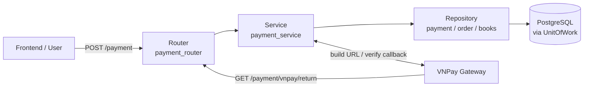

# Payment Flow — Flow & Logic Notes

> Architecture and processing flow notes for the payment module of the Book Management project.
> Covers order payment via VNPay (and Cash/COD), from payment URL creation to callback verification and database updates.

---

## 1. Architecture Overview

One-directional pipeline, each layer has one responsibility:

### Layer responsibilities

| Layer | Question | Location |
|---|---|---|
| Router | "Which HTTP request is coming in?" | `app/routers/payment_router.py` |
| Service | "What business rules apply?" | `app/services/payment_service.py` |
| Repository | "How to read/write the database?" | `app/repositories/payment_repository.py`, `app/repositories/order_repository.py` |
| VNPay Utils | "How to sign & verify with the gateway?" | `app/utils/vnpay.py` |
| DB / UnitOfWork | "One request = one transaction" | `app/orm/unit_of_work.py` |

### Core principles

- `payment_router` is the **only** HTTP entry point for payment requests.
- `payment_service` owns all business validation and database updates; it never touches HTTP details.
- The service only works with **order/payment aggregates** — repositories handle the raw SQL/SQLAlchemy queries.
- All database changes for one request run inside a single **UnitOfWork** (auto-commit on success, auto-rollback on error).
- The gateway callback (`/payment/vnpay/return`) is a **separate, unauthenticated** flow — security relies on VNPay's HMAC SHA512 signature, not the user's JWT.
