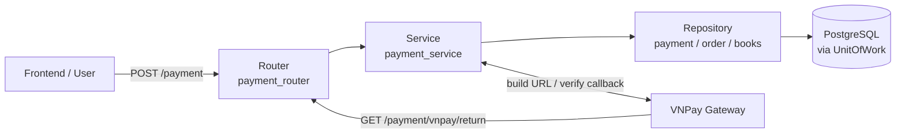
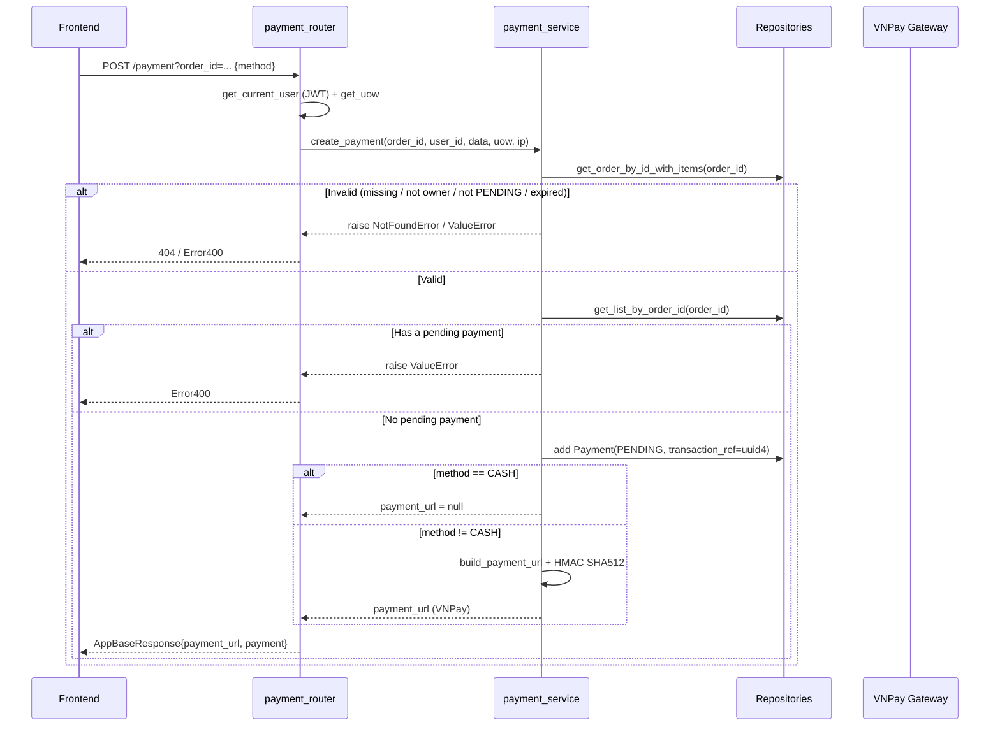
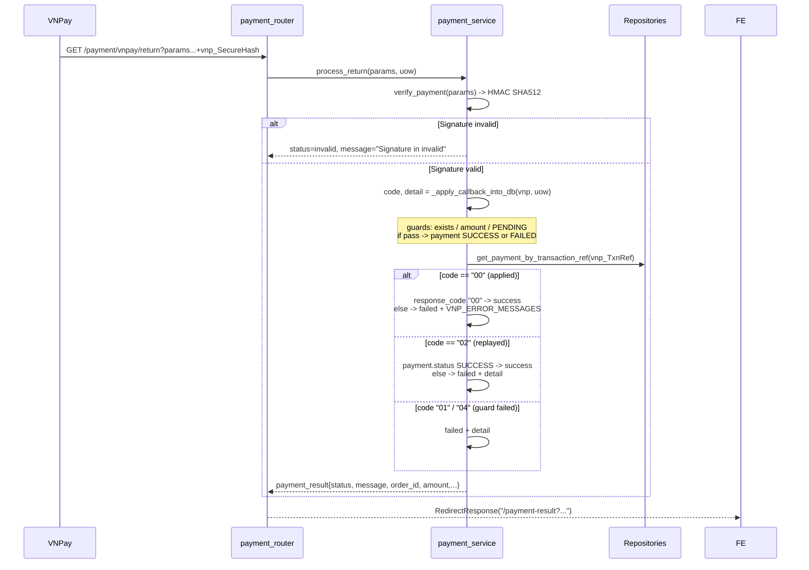

# Payment Flow — Flow & Logic Notes

> Architecture and processing flow notes for the payment module of the Book Management project.
> Covers order payment via VNPay (and Cash/COD), from payment URL creation to callback verification and database updates.

---

## 1. Architecture Overview

One-directional pipeline, each layer has one responsibility:



### Layer responsibilities

| Layer | Question | Location |
|---|---|---|
| Router | "Which HTTP request is coming in?" | `app/routers/payment_router.py` |
| Service | "What business rules apply?" | `app/services/payment_service.py` |
| Repository | "How to read/write the database?" | `app/repositories/payment_repository.py`, `app/repositories/order_repository.py` |
| VNPay Utils | "How to sign & verify with the gateway?" | `app/utils/vnpay.py` |
| DB / UnitOfWork | "One request = one transaction" | `app/orm/unit_of_work.py` |

### Core principles

- `payment_router` is the **only** HTTP entry point for payment requests.
- `payment_service` owns all business validation and database updates; it never touches HTTP details.
- The service only works with **order/payment aggregates** — repositories handle the raw SQL/SQLAlchemy queries.
- All database changes for one request run inside a single **UnitOfWork** (auto-commit on success, auto-rollback on error).
- The gateway callback (`/payment/vnpay/return`) is a **separate, unauthenticated** flow — security relies on VNPay's HMAC SHA512 signature, not the user's JWT.

---

## 2. File Map

Ordered top-down, following the request path:

| File | Role |
|---|---|
| `app/main.py` | App wiring; defines `/payment-result` page (renders `payment_result.html`) |
| `app/routers/payment_router.py` | HTTP entry: `POST /payment` and `GET /payment/vnpay/return` |
| `app/api/deps.py` | `get_current_user` dependency — decodes JWT, returns `User` |
| `app/services/payment_service.py` | Business logic: `create_payment`, `process_return`, `_apply_callback_into_db` |
| `app/services/cart_service.py` | `restore_order_items_to_cart` — restore cart after user cancel |
| `app/utils/vnpay.py` | VNPay helpers: `_secure_hash`, `build_payment_url`, `verify_payment`, `parse_vnpay_date` |
| `app/constants/vnpay.py` | `VNP_ERROR_MESSAGES` — map response code → message |
| `app/repositories/payment_repository.py` | `Payment` queries: `get_list_by_order_id`, `get_payment_by_transaction_ref` |
| `app/repositories/order_repository.py` | `Order` queries: `get_order_by_id_with_items` |
| `app/repositories/book_repository.py` | `Book` queries: `get_by_id_for_update` (restock on cancel) |
| `app/repositories/cart_repository.py` | `Cart` queries: `get_cart_by_user_id` |
| `app/repositories/cart_item_repository.py` | `CartItem` queries: `add`, `get_list_by_cart_id` |
| `app/models/payment_model.py` | ORM model `Payment` |
| `app/models/order_model.py` | ORM model `Order` (+ `order_items` relationship) |
| `app/schemas/payment_schema.py` | Schemas: `CreatePaymentReq`, `PaymentRes`, `PaymentUrlRes` |
| `app/enum/common.py` | Enums: `PaymentMethod`, `PaymentStatus`, `OrderStatus` |
| `app/orm/unit_of_work.py` | `UnitOfWork` — one DB transaction per HTTP request |
| `app/db/database.py` | `get_uow()` factory + repository registrations |
| `app/configs/config.py` | VNPay config: `VNPAY_TMN_CODE`, `VNPAY_URL`, `VNPAY_RETURN_URL`, `VNPAY_HASH_SECRET`, `PAYMENT_EXPIRY_MINUTES` |
| `app/templates/payment_result.html` | Success/fail result page rendered by `/payment-result` |

---

## 3. API Endpoints

`app/router/payment_router.py`

| # | Method & Path | Auth | Purpose |
|---|---|---|---|
| 3.1 | `POST /payment` | ✅ Bearer JWT | Create a payment for an order, returns a gateway URL |
| 3.2 | `GET /payment/vnpay/return` | ❌ (signature) | VNPay callback after user pays at the gateway |
| 3.3 | `GET /payment-result` | ❌ | Render the success/fail result page |

### 3.1 `POST /payment` — Create payment

| Aspect | Value |
|---|---|
| Method / Path | `POST /payment` |
| Auth | Required — `Authorization: Bearer <access_token>` (`get_current_user`) |
| Query param | `order_id` (required) |
| Body | `CreatePaymentReq` → `{"method": "cash" \| "bank_transfer" \| "momo"}` |
| Success | `200` — `AppBaseResponse[PaymentUrlRes]` |
| Business error | `Error400` (e.g. order not PENDING, duplicate pending payment) |
| Not found | `404` — `NotFoundError` (order does not exist or not owned) |

**Request**

```http
POST /payment?order_id=019e4b6e-... HTTP/1.1
Authorization: Bearer <access_token>
Content-Type: application/json

{"method": "bank_transfer"}
```

**Response (VNPay method)**

```json
{
  "data": {
    "payment_url": "https://sandbox.vnpayment.vn/paymentv2/vpcpay.html?vnp_Version=2.1.0&vnp_Command=pay&...&vnp_SecureHash=...",
    "payment": {
      "id": "019e4c11-...",
      "order_id": "019e4b6e-...",
      "user_id": "019d5f2a-...",
      "amount": 250000.0,
      "payment_method": "bank_transfer",
      "status": "pending",
      "transaction_ref": "019e4c11-...",
      "gateway_txn_no": null,
      "bank_code": null,
      "pay_date": null,
      "ip_address": "127.0.0.1",
      "error_message": null,
      "created_at": "2026-09-23T07:30:00Z"
    }
  },
  "message": "Payment created successfully"
}
```

> For `method = "cash"`, `payment_url` is `null` (no gateway redirect — paid on delivery).

### 3.2 `GET /payment/vnpay/return` — VNPay callback

| Aspect | Value |
|---|---|
| Method / Path | `GET /payment/vnpay/return` |
| Auth | None — secured by VNPay's HMAC SHA512 signature |
| Query params | Everything VNPay sends back (`vnp_*` + `vnp_SecureHash`) |
| Response | `307` — `RedirectResponse` to `/payment-result?...` |
| In docs | `include_in_schema=False` (hidden from Swagger) |

**Request (from VNPay)**

```http
GET /payment/vnpay/return?vnp_Amount=25000000&vnp_BankCode=NCB&vnp_OrderInfo=Payment+for+order+...&vnp_PayDate=20260923143000&vnp_ResponseCode=00&vnp_TmnCode=...&vnp_TransactionNo=...&vnp_TxnRef=019e4c11-...&vnp_SecureHash=... HTTP/1.1
```

**Response (redirect)**

```http
HTTP/1.1 307 Temporary Redirect
Location: /payment-result?status=success&message=Payment+successful&txn_ref=019e4c11-...&order_id=...&amount=250%2C000&gateway_txn_no=...&method=Bank+Transfer&pay_date=14%3A30+23%2F09%2F2026
```

### 3.3 `GET /payment-result` — Result page

| Aspect | Value |
|---|---|
| Method / Path | `GET /payment-result` |
| Auth | None |
| Query params | `status`, `message`, `txn_ref`, `order_id`, `amount`, `gateway_txn_no`, `method`, `pay_date` |
| Response | `200` — HTML (`payment_result.html`) |

> This route lives in `app/main.py` (not in `payment_router`). It renders the `payment_result.html` template with the query-string values produced by `process_return`.

---

## 4. Case 1 — Create payment

### Payload

```http
POST /payment?order_id=019e4b6e-... HTTP/1.1
Authorization: Bearer <access_token>

{"method": "bank_transfer"}
```

### Flow



### Validation chain

`create_payment` performs 5 checks **in order** before creating the payment record:

| # | Check | Fail → | Why? |
|---|---|---|---|
| 1 | Order exists | `NotFoundError("Order", order_id)` → 404 | A payment can only reference an existing order — otherwise `order.total_price` and `order.id` would fail |
| 2 | `order.user_id == current_user.id` (owner) | `NotFoundError("Order", order_id)` → 404 | Only the buyer can pay for their own order; 404 (not 403) hides the existence of other users' orders |
| 3 | `order.status == PENDING` | `ValueError("Order is not in PENDING state")` → 400 | Only an order awaiting payment can be paid — prevents re-paying an already confirmed/cancelled order |
| 4 | `order.expires_at` not passed | `ValueError("Order payment deadline has expired")` → 400 | Orders have a payment deadline; blocking expired orders prevents paying for a no-longer-valid order |
| 5 | No existing payment with `status == PENDING` | `ValueError("Order already has a pending payment")` → 400 | One pending payment per order — prevents duplicate payments and avoids double charging the buyer |

### Trace — file by file

#### 4.1 `app/routers/payment_router.py`

```python
@router.post("/", response_model=AppBaseResponse[PaymentUrlRes], summary="Create a payment for an order")
async def create_payment(
    data: CreatePaymentReq,                               # {"method": "bank_transfer"}
    order_id: str = Query(..., description="Order ID"),   # order_id = "019e4b6e-..."
    uow: IUnitOfWork = Depends(get_uow),                  # UnitOfWork (1 session)
    current_user: User = Depends(get_current_user),       # decoded from JWT
    request: Request = None,
):
    async with uow:            # start session, commit/rollback on exit
        try:
            client_ip = request.client.host if request and request.client else "127.0.0.1"
            # client_ip = "127.0.0.1"

            response = await payment_service.create_payment(
                order_id=order_id, user_id=current_user.id, data=data,
                uow=uow, ip_address=client_ip,
            )
            return AppBaseResponse(data=response, message="Payment created successfully")
        except ValueError as ex:
            return Error400(str(ex))
```

> `NotFoundError` is a `BaseAppException` handled globally by `app/main.py`; `ValueError` is caught here and turned into `Error400`.

#### 4.2 `app/services/payment_service.py` — `create_payment`

```python
async def create_payment(order_id, user_id, data, uow, ip_address="127.0.0.1") -> PaymentUrlRes:
    # ---- Check 1: order exists ----
    order = await uow.order.get_order_by_id_with_items(order_id)
    # order = Order(id=..., user_id=..., status=PENDING, total_price=250000.0,
    #               expires_at=2026-09-23 07:40:00+00:00, order_items=[...])
    if not order:
        raise NotFoundError("Order", order_id)

    # ---- Check 2: owner ----
    if str(order.user_id) != str(user_id):
        raise NotFoundError("Order", order_id)

    # ---- Check 3: PENDING ----
    if order.status != OrderStatus.PENDING:
        raise ValueError("Order is not in PENDING state")

    # ---- Check 4: expired ----
    now = datetime.now(UTC)                                   # 2026-09-23 07:30:00+00:00
    if order.expires_at and order.expires_at < now:
        raise ValueError("Order payment deadline has expired")

    # ---- Check 5: no pending payment yet ----
    payments = await uow.payment.get_list_by_order_id(order_id)
    if any(payment.status == PaymentStatus.PENDING for payment in payments):
        raise ValueError("Order already has a pending payment")

    # ---- Create payment ----
    payment = await uow.payment.add(
        Payment(
            user_id=order.user_id,
            order_id=order.id,
            amount=order.total_price,                         # 250000.0
            payment_method=data.method,                       # PaymentMethod.CREDIT ("bank_transfer")
            status=PaymentStatus.PENDING,
            expires_at=now + timedelta(minutes=config.PAYMENT_EXPIRY_MINUTES),
            # expires_at = 07:30:00 + 10 min = 07:40:00
            transaction_ref=str(uuid4()),                     # unique txn_ref for the gateway
            ip_address=ip_address,
        )
    )

    # ---- Build gateway URL ----
    if data.method == PaymentMethod.CASH:
        payment_url = None                             # COD → no redirect
    else:
        payment_url = build_payment_url(
            amount=payment.amount,
            txn_ref=payment.transaction_ref,
            order_desc=f"Payment for order {order.id}",
            ip_address=ip_address,
            expire_at=order.expires_at,                # NOTE: order.expires_at, not payment.expires_at
        )

    return PaymentUrlRes(payment_url=payment_url, payment=payment_to_res(payment))
```

#### 4.3 `app/utils/vnpay.py` — `build_payment_url` + `_secure_hash`

```python
def build_payment_url(*, amount, txn_ref, order_desc, ip_address, expire_at) -> str:
    now = datetime.now(VN_TIMEZONE)
    params = {
        "vnp_Version": "2.1.0",
        "vnp_Command": "pay",
        "vnp_TmnCode": config.VNPAY_TMN_CODE,
        "vnp_Amount": str(int(round(amount * 100))),          # 250000.0 * 100 = 25000000 (VND ×100)
        "vnp_CurrCode": "VND",
        "vnp_TxnRef": txn_ref,                                # the uuid4 transaction_ref
        "vnp_OrderInfo": order_desc,                          # "Payment for order ..."
        "vnp_OrderType": "250000",
        "vnp_Locale": "vn",
        "vnp_CreateDate": now.strftime("%Y%m%d%H%M%S"),
        "vnp_ExpireDate": expire_at.astimezone(VN_TIMEZONE).strftime("%Y%m%d%H%M%S"),
        "vnp_IpAddr": ip_address,
        "vnp_ReturnUrl": config.VNPAY_RETURN_URL,             # .../api/v1/payment/vnpay/return
    }

    params["vnp_SecureHash"] = _secure_hash(params)           # HMAC SHA512 over all vnp_* fields
    return f"{config.VNPAY_URL}?{urlencode(params)}"
```

```python
def _secure_hash(params: dict[str, str]) -> str:
    raw = urlencode(sorted(params.items()))                   # sort keys → canonical string
    return hmac.new(
        config.VNPAY_HASH_SECRET.encode("utf-8"),
        raw.encode("utf-8"),
        hashlib.sha512,
    ).hexdigest()
```


---


## 5. Case 2 — VNPay callback SUCCESS (`00`)

### Payload

After the user pays at the gateway, VNPay redirects the browser to `VNPAY_RETURN_URL` with a signed query string:

```http
GET /payment/vnpay/return?vnp_Amount=25000000&vnp_BankCode=NCB&vnp_BankTranNo=...&vnp_CardType=...&vnp_OrderInfo=Payment+for+order+...&vnp_PayDate=20260923143000&vnp_ResponseCode=00&vnp_TmnCode=...&vnp_TransactionNo=...&vnp_TxnRef=019e4c11-...&vnp_SecureHash=... HTTP/1.1
```

Key fields:

| Field | Example | Meaning |
|---|---|---|
| `vnp_ResponseCode` | `00` | Gateway result — `00` = success |
| `vnp_TxnRef` | `019e4c11-...` | The `transaction_ref` set at payment creation |
| `vnp_Amount` | `25000000` | Paid amount in VND ×100 (compare with `payment.amount * 100`) |
| `vnp_TransactionNo` | `...` | Gateway's own transaction number |
| `vnp_PayDate` | `20260923143000` | Payment time (`YYYYMMDDHHMMSS`) |
| `vnp_SecureHash` | `...` | HMAC SHA512 over all `vnp_*` fields |

### Flow



### Callback verification chain

`_apply_callback_into_db` performs 4 guards **in order** before mutating anything:

| # | Guard | Fail → | Why? |
|---|---|---|---|
| 1 | Payment exists (`vnp_TxnRef` matches a row) | return `("01", "Order not found")` | The callback must reference a real payment created earlier |
| 2 | `vnp_Amount == payment.amount * 100` | return `("04", "Invalid amount")` | Detect a tampered/incorrect amount — never trust the gateway blindly |
| 3 | `payment.status == PENDING` | return `("02", "Order already confirmed")` | Payment must be PENDING |
| 4 | `vnp_ResponseCode == "00"` | treat as FAILED | The gateway result decides success vs failure |

> `process_return` now **catches** the code returned by `_apply_callback_into_db` and maps it to the user-facing `status`/`message`:
> - `"00"` (applied) → success/failed decided by the gateway `vnp_ResponseCode`
> - `"02"` (replayed) → read the real `payment.status` (still `success` if already SUCCESS)
> - `"01"` / `"04"` (guard failed) → `failed` with the guard's `detail`

### Trace — file by file

#### 5.1 `app/routers/payment_router.py` — `vnpay_return`

```python
@router.get("/vnpay/return", include_in_schema=False)
async def vnpay_return(
    request: Request,
    uow: IUnitOfWork = Depends(get_uow),
):
    params = dict(request.query_params)
    # params = {"vnp_Amount": "25000000", ..., "vnp_ResponseCode": "00", ...,
    #           "vnp_TxnRef": "019e4c11-...", "vnp_SecureHash": "..."}

    async with uow:
        redirect_url = await payment_service.process_return(params, uow)
    return RedirectResponse(url=redirect_url)
    # → 307 to /payment-result?status=success&message=Payment+successful&...
```

#### 5.2 `app/services/payment_service.py` — `process_return`

```python
async def process_return(params: dict, uow: IUnitOfWork) -> str:
    status = "invalid"
    message = "Signature in invalid"
    payment = None

    try:
        # ---- 1. Verify signature ----
        vnp = verify_payment(params)
        # vnp = {"vnp_Amount": "25000000", ..., "vnp_ResponseCode": "00", ...}
        # (vnp_SecureHash removed — it was used for the comparison only)

        # ---- 2. Apply callback into DB & CATCH the result code ----
        code, detail = await _apply_callback_into_db(vnp, uow)
        # code = "00" (applied) | "01" (not found) | "04" (amount) | "02" (replayed)

        # ---- 3. Reload payment to build the result page data ----
        payment = await uow.payment.get_payment_by_transaction_ref(
            vnp.get("vnp_TxnRef", "")
        )

        # ---- 4. Map code → status/message ----
        if code == "00":
            # applied: the gateway result decides
            if vnp.get("vnp_ResponseCode") == "00":
                status, message = "success", "Payment successful"
            else:
                status = "failed"
                message = VNP_ERROR_MESSAGES.get(
                    vnp.get("vnp_ResponseCode"), "Payment failed"
                )
        elif code == "02":
            # replayed callback: show the real payment state
            if payment and payment.status == PaymentStatus.SUCCESS:
                status, message = "success", "Payment successful"
            else:
                status, message = "failed", detail
        else:
            # "01" (not found) or "04" (amount mismatch)
            status, message = "failed", detail
    except ValueError:
        pass                         # bad signature → keep "invalid"
    except Exception:
        logger.exception("Return callback error")
        message = "System error, please try again"

    payment_result = {
        "status": status,
        "message": message,
        "txn_ref": params.get("vnp_TxnRef", ""),
    }

    if payment:
        payment_result.update({
            "order_id": str(payment.order_id),
            "amount": f"{payment.amount:,.0f}",
            "gateway_txn_no": payment.gateway_txn_no or "",
            "method": payment.payment_method.label,
            "pay_date": (
                payment.pay_date.strftime("%H:%M %d/%m/%Y")
                if payment.pay_date else ""
            ),
        })

    return f"/payment-result?{urlencode(payment_result)}"
```

#### 5.3 `app/utils/vnpay.py` — `verify_payment`

```python
def verify_payment(params: dict[str, str]) -> dict[str, str]:
    secure_hash = params.get("vnp_SecureHash", "")

    vnp_params = {}
    for key, value in params.items():
        if key.startswith("vnp_") and key != "vnp_SecureHash":
            vnp_params[key] = value
        # collect all vnp_* fields EXCEPT vnp_SecureHash

    # recompute HMAC SHA512 from received fields
    expected = _secure_hash(vnp_params)   

     # constant-time comparison
    if not hmac.compare_digest(expected, secure_hash):
        raise ValueError("Invalid VNPay signature") 

    return vnp_params
```

#### 5.4 `app/services/payment_service.py` — `_apply_callback_into_db`

```python
async def _apply_callback_into_db(vnpay: dict, uow: IUnitOfWork) -> tuple[str, str]:
    # ---- Guard 1: payment exists ----
    payment = await uow.payment.get_payment_by_transaction_ref(vnpay["vnp_TxnRef"])
    # payment = Payment(status=PENDING, amount=250000.0, transaction_ref="019e4c11-...")
    if not payment:
        return "01", "Order not found"

    # ---- Guard 2: amount matches ----
    vnp_amount = int(vnpay.get("vnp_Amount", "0"))          # 25000000
    expected_amount = int(round(payment.amount * 100))      # 250000.0 * 100 = 25000000
    if vnp_amount != expected_amount:
        return "04", "Invalid amount"

    # ---- Guard 3: still pending ----
    if payment.status != PaymentStatus.PENDING:
        return "02", "Order already confirmed"

    payment.raw_callback = vnpay  # store the raw callback for audit

    # ---- Guard 4: success vs failed ----
    if vnpay.get("vnp_ResponseCode") == "00":
        payment.status = PaymentStatus.SUCCESS
        payment.gateway_txn_no = vnpay.get("vnp_TransactionNo")
        payment.bank_code = vnpay.get("vnp_BankCode")
        payment.pay_date = parse_vnpay_date(vnpay.get("vnp_PayDate"))
        # pay_date = 2026-09-23 14:30:00+07:00 (parsed from "20260923143000")
        payment.expires_at = None

        # Promote the order PENDING → CONFIRMED
        order = await uow.order.get_order_by_id_with_items(str(payment.order_id))
        if order and order.status == OrderStatus.PENDING:
            order.status = OrderStatus.CONFIRMED
            order.expires_at = None
    else:
        payment.status = PaymentStatus.FAILED
        # ... (Case 3 covers the cancel branch)

    return "00", "Confirm payment result from successful"
```
