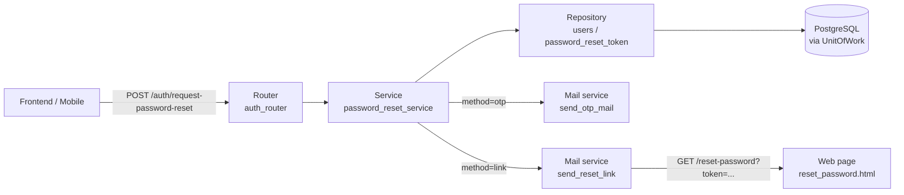
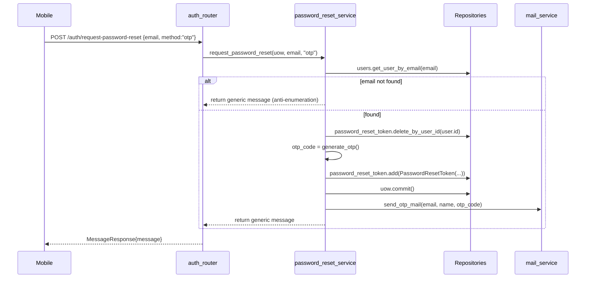
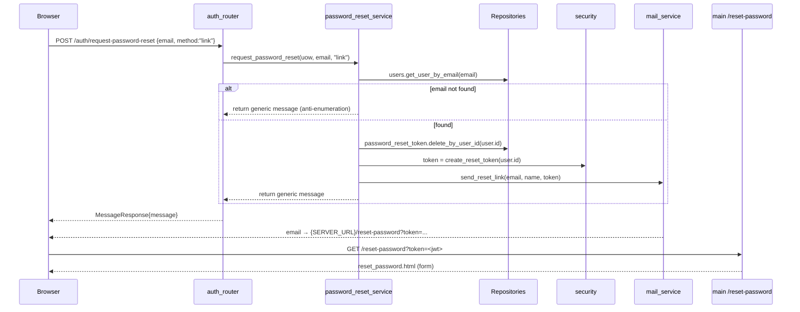

# Password Reset Flow — Flow & Logic Notes

> Architecture and processing flow notes for the password reset feature of the Book Management project.
> Covers requesting a reset via **OTP** (mobile) or **reset link** (web), verifying the OTP, and setting a new password.

---

## 1. Architecture Overview

One-directional pipeline, each layer has one responsibility:



### Core principles

- `auth_router` is the **only** HTTP entry point for password reset — 3 endpoints: request → verify → reset.
- `password_reset_service` owns all business validation and database updates; it never touches HTTP details.
- Two flows share one final step (`reset_password`), differing only in how the reset token is delivered:
  - **Mobile (`method=otp`)**: server generates a 6-digit OTP, stores it in `PasswordResetToken` (expires in 5 minutes) and emails it; the client verifies the OTP to receive a reset JWT.
  - **Web (`method=link`)**: server creates a reset JWT and emails a link `{SERVER_URL}/reset-password?token=...`; the browser opens that page and submits the new password.
- **Anti-enumeration**: when the email does not exist, the service still returns the same generic message, so the caller cannot tell whether the account is registered.
- Before issuing a new reset, any previous reset record for the user is deleted (`delete_by_user_id`) to invalidate old OTPs/tokens.
- The reset JWT is short-lived (`RESET_LINK_EXPIRE_MINUTES = 5`) and carries `type="reset"`; `verify_reset_token` rejects tokens with the wrong type or an expired signature.
- Each reset request runs inside a single **UnitOfWork** (auto-commit on success, auto-rollback on error).

---

## 2. File Map

Ordered top-down, following the request path:

| Layer | File | Role |
|---|---|---|
| Router | `app/routers/auth_router.py` | HTTP entry: `request-password-reset`, `verify-otp`, `reset-password` |
| Page | `app/main.py` | `GET /reset-password` — renders the web form `reset_password.html` |
| Service | `app/services/password_reset_service.py` | Business logic: `request_password_reset`, `verify_otp`, `reset_password` |
|  | `app/services/mail_service.py` | Emails: `send_otp_mail` (mobile), `send_reset_link` (web) |
| Utils | `app/utils/security.py` | `generate_otp`, `create_reset_token`, `verify_reset_token`, `hash_password` |
| Repository | `app/repositories/password_reset_repository.py` | `PasswordResetToken` queries: `delete_by_user_id`, `find_valid_otp` |
|  | `app/repositories/user_repository.py` | `User` queries: `get_user_by_email`, `get_by_id` (inherited) |
| Model | `app/models/password_reset_model.py` | ORM model `PasswordResetToken` (`otp_code`, `token`, `expires_at`, `used`) |
| Enum | `app/enum/common.py` | Enum `ResetMethod` (`otp` / `link`) |
| Exceptions | `app/exceptions/token_exception.py` | `InvalidOTPError`, `ExpiredTokenError`, `InvalidTokenError` |
|  | `app/exceptions/resource_exception.py` | `NotFoundError` — user not found on reset |
| Schema | `app/schemas/password_reset_schema.py` | `ForgetPasswordReq`, `VerifyOTPReq/Res`, `ResetPasswordReq`, `MessageResponse` |
| Template | `app/templates/otp_mail.html` | Email body for OTP (mobile) |
|  | `app/templates/reset_link_mail.html` | Email body containing the reset link (web) |
|  | `app/templates/reset_password.html` | Web form to enter a new password |
| DB | `app/orm/unit_of_work.py` | `UnitOfWork` — one DB transaction per HTTP request |
| ORM | `app/orm/repository.py` | Generic `Repository` — `add`, `get_by_id`, `delete` |
| Config | `app/configs/config.py` | `SERVER_URL` — base URL used to build the reset link |

---

## 3. API Endpoints

| # | Method & Path | Auth | Purpose |
|---|---|---|---|
| 3.1 | `POST /auth/request-password-reset` | ❌ | Send OTP (mobile) or reset link (web) to the email |
| 3.2 | `POST /auth/verify-otp` | ❌ | Mobile only: verify OTP → return a `reset_token` |
| 3.3 | `POST /auth/reset-password` | ❌ | Set a new password using the `reset_token` |
| 3.4 | `GET /reset-password?token=...` | ❌ | Web page (not in OpenAPI schema) to enter a new password |

---

## 4. Case 1 — Request reset via OTP (mobile)

### Payload

```http
POST /auth/request-password-reset HTTP/1.1
Content-Type: application/json

{"email": "user@example.com", "method": "otp"}
```

### Flow



### Validation chain

| # | Step | Behavior | Why? |
|---|---|---|---|
| 1 | Email exists | If missing → still return the generic message (200) | Anti-enumeration: don't reveal whether the account exists |
| 2 | Delete old reset record | `delete_by_user_id(user.id)` | Invalidate any previous OTP/token before issuing a new one |
| 3 | Generate OTP | `generate_otp()` → 6 digits, `expires_at = now + 5 min` | Short TTL limits brute-force window |

### Trace — file by file

#### 4.1 `app/routers/auth_router.py` — `request_password_reset`

```python
@router.post(
    "/request-password-reset", status_code=HTTPStatus.OK, response_model=MessageResponse
)
async def request_password_reset(
    data: ForgetPasswordReq, uow: IUnitOfWork = Depends(get_uow)
):
    async with uow:
        message = await password_reset_service.request_password_reset(
            uow, data.email, data.method
        )
    return MessageResponse(message=message)
```

#### 4.2 `app/services/password_reset_service.py` — `request_password_reset`

```python
async def request_password_reset(uow: IUnitOfWork, email: str, method: str) -> str:
    # Check
    user = await uow.users.get_user_by_email(email)
    if not user:
        logger.warning("Password reset requested for non-existent email: %s", email)
        return "If this email is registered, an OTP has been sent"

    await uow.password_reset_token.delete_by_user_id(user_id=user.id)

    # OTP
    if method == ResetMethod.OTP:
        otp_code = generate_otp()
        expires_at = datetime.now(UTC) + timedelta(minutes=OTP_EXPIRE_MINUTES)

        reset_token = PasswordResetToken(
            user_id=user.id,
            otp_code=otp_code,
            method=ResetMethod.OTP,
            expires_at=expires_at,
        )
        await uow.password_reset_token.add(reset_token)
        await uow.commit()

        await mail_service.send_otp_mail(
            email=user.email, name=user.name, otp_code=otp_code
        )
        logger.info("Password reset OTP sent | email=%s", user.email)

    return "If this email is registered, a reset instruction has been sent."
```

#### 4.3 `app/utils/security.py` — `generate_otp`

```python
def generate_otp() -> str:
    """Generate 6 numbers OTP - integer numbers (Mobile only)"""
    return f"{random.randint(0, 999999):06d}"
```

#### 4.4 `app/repositories/password_reset_repository.py` — `delete_by_user_id`

```python
async def delete_by_user_id(self, user_id: str) -> None:
    stmt = delete(PasswordResetToken).where(PasswordResetToken.user_id == user_id)
    await self.session.execute(stmt)
```

#### 4.5 `app/services/mail_service.py` — `send_otp_mail`

```python
async def send_otp_mail(email: str, name: str, otp_code: str) -> None:
    template = jinja_env.get_template("otp_mail.html")
    html = template.render(
        name=name, otp_code=otp_code, server_url=config.SERVER_URL, year=datetime.now().year
    )
    message = MessageSchema(
        subject="🔐 Password Reset OTP - Book Management",
        recipients=[email], body=html, subtype="html",
    )
    await get_mail().send_message(message)
```

**Result:** a `PasswordResetToken` row (`method=otp`, `otp_code`, `expires_at = now + 5 min`, `used=False`) is committed; the OTP is emailed via `otp_mail.html`. The client must then call `verify-otp` (Case 3) to exchange the OTP for a reset token.

---

## 5. Case 2 — Request reset via link (web)

### Payload

```http
POST /auth/request-password-reset HTTP/1.1
Content-Type: application/json

{"email": "user@example.com", "method": "link"}
```

### Flow



### Validation chain

| # | Step | Behavior | Why? |
|---|---|---|---|
| 1 | Email exists | If missing → still return the generic message (200) | Anti-enumeration |
| 2 | Delete old reset record | `delete_by_user_id(user.id)` | Invalidate any previous OTP/token |
| 3 | Create reset JWT | `create_reset_token(user.id)` → `{id, type:"reset", exp: now + 5 min}` | Short-lived, scoped to `type="reset"` |

### Trace — file by file

#### 5.1 `app/services/password_reset_service.py` — `request_password_reset` (LINK branch)

```python
async def request_password_reset(uow: IUnitOfWork, email: str, method: str) -> str:
    user = await uow.users.get_user_by_email(email)
    if not user:
        logger.warning("Password reset requested for non-existent email: %s", email)
        return "If this email is registered, an OTP has been sent"

    await uow.password_reset_token.delete_by_user_id(user_id=user.id)

    # Link (Web): send email with a link to the reset password page
    elif method == ResetMethod.LINK:
        token = create_reset_token(str(user.id))

        await mail_service.send_reset_link(
            email=user.email,
            name=user.name,
            token=token,
        )
        logger.info("Password reset link sent | email=%s", user.email)

    return "If this email is registered, a reset instruction has been sent."
```

#### 5.2 `app/utils/security.py` — `create_reset_token`

```python
def create_reset_token(user_id: str) -> str:
    """Create JWT contain user_id"""

    expire = datetime.now(UTC) + timedelta(minutes=RESET_LINK_EXPIRE_MINUTES)
    payload = {"id": user_id, "type": "reset", "exp": expire}
    return jwt.encode(payload, config.JWT_SECRET_KEY, algorithm=config.JWT_ALGORITHM)
```

#### 5.3 `app/services/mail_service.py` — `send_reset_link`

```python
async def send_reset_link(email: str, name: str, token: str) -> None:
    template = jinja_env.get_template("reset_link_mail.html")

    reset_url = f"{config.SERVER_URL}/reset-password?token={token}"
    html = template.render(name=name, reset_url=reset_url)

    message = MessageSchema(
        subject="🔑 Reset Your Password - Book Management",
        recipients=[email], body=html, subtype="html",
    )
    await get_mail().send_message(message)
```

#### 5.4 `app/main.py` — `reset_password_page`

```python
@app.get("/reset-password", include_in_schema=False)
async def reset_password_page(request: Request, token: str = ""):
    """Render the web page for resetting password."""
    return templates.TemplateResponse(request, "reset_password.html", {"token": token})
```

**Result:** no DB record is written for the link flow — the reset JWT lives only in the email. The user opens `{SERVER_URL}/reset-password?token=<jwt>`, gets the `reset_password.html` form, and submits the new password to `POST /auth/reset-password` (Case 4).