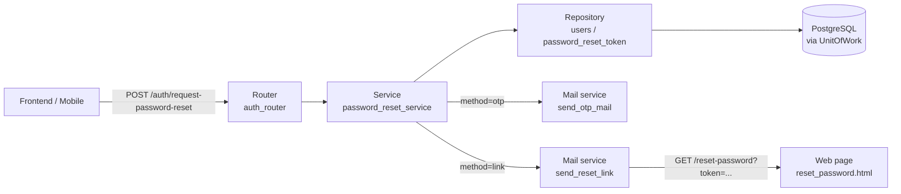

# Password Reset Flow — Flow & Logic Notes

> Architecture and processing flow notes for the password reset feature of the Book Management project.
> Covers requesting a reset via **OTP** (mobile) or **reset link** (web), verifying the OTP, and setting a new password.

---

## 1. Architecture Overview

One-directional pipeline, each layer has one responsibility:

### Core principles

- `auth_router` is the **only** HTTP entry point for password reset — 3 endpoints: request → verify → reset.
- `password_reset_service` owns all business validation and database updates; it never touches HTTP details.
- Two flows share one final step (`reset_password`), differing only in how the reset token is delivered:
  - **Mobile (`method=otp`)**: server generates a 6-digit OTP, stores it in `PasswordResetToken` (expires in 5 minutes) and emails it; the client verifies the OTP to receive a reset JWT.
  - **Web (`method=link`)**: server creates a reset JWT and emails a link `{SERVER_URL}/reset-password?token=...`; the browser opens that page and submits the new password.
- **Anti-enumeration**: when the email does not exist, the service still returns the same generic message, so the caller cannot tell whether the account is registered.
- Before issuing a new reset, any previous reset record for the user is deleted (`delete_by_user_id`) to invalidate old OTPs/tokens.
- The reset JWT is short-lived (`RESET_LINK_EXPIRE_MINUTES = 5`) and carries `type="reset"`; `verify_reset_token` rejects tokens with the wrong type or an expired signature.
- Each reset request runs inside a single **UnitOfWork** (auto-commit on success, auto-rollback on error).

---

## 2. File Map

Ordered top-down, following the request path:

| Layer | File | Role |
|---|---|---|
| Router | `app/routers/auth_router.py` | HTTP entry: `request-password-reset`, `verify-otp`, `reset-password` |
| Page | `app/main.py` | `GET /reset-password` — renders the web form `reset_password.html` |
| Service | `app/services/password_reset_service.py` | Business logic: `request_password_reset`, `verify_otp`, `reset_password` |
|  | `app/services/mail_service.py` | Emails: `send_otp_mail` (mobile), `send_reset_link` (web) |
| Utils | `app/utils/security.py` | `generate_otp`, `create_reset_token`, `verify_reset_token`, `hash_password` |
| Repository | `app/repositories/password_reset_repository.py` | `PasswordResetToken` queries: `delete_by_user_id`, `find_valid_otp` |
|  | `app/repositories/user_repository.py` | `User` queries: `get_user_by_email`, `get_by_id` (inherited) |
| Model | `app/models/password_reset_model.py` | ORM model `PasswordResetToken` (`otp_code`, `token`, `expires_at`, `used`) |
| Enum | `app/enum/common.py` | Enum `ResetMethod` (`otp` / `link`) |
| Exceptions | `app/exceptions/token_exception.py` | `InvalidOTPError`, `ExpiredTokenError`, `InvalidTokenError` |
|  | `app/exceptions/resource_exception.py` | `NotFoundError` — user not found on reset |
| Schema | `app/schemas/password_reset_schema.py` | `ForgetPasswordReq`, `VerifyOTPReq/Res`, `ResetPasswordReq`, `MessageResponse` |
| Template | `app/templates/otp_mail.html` | Email body for OTP (mobile) |
|  | `app/templates/reset_link_mail.html` | Email body containing the reset link (web) |
|  | `app/templates/reset_password.html` | Web form to enter a new password |
| DB | `app/orm/unit_of_work.py` | `UnitOfWork` — one DB transaction per HTTP request |
| ORM | `app/orm/repository.py` | Generic `Repository` — `add`, `get_by_id`, `delete` |
| Config | `app/configs/config.py` | `SERVER_URL` — base URL used to build the reset link |

---

## 3. API Endpoints

| # | Method & Path | Auth | Purpose |
|---|---|---|---|
| 3.1 | `POST /auth/request-password-reset` | ❌ | Send OTP (mobile) or reset link (web) to the email |
| 3.2 | `POST /auth/verify-otp` | ❌ | Mobile only: verify OTP → return a `reset_token` |
| 3.3 | `POST /auth/reset-password` | ❌ | Set a new password using the `reset_token` |
| 3.4 | `GET /reset-password?token=...` | ❌ | Web page (not in OpenAPI schema) to enter a new password |