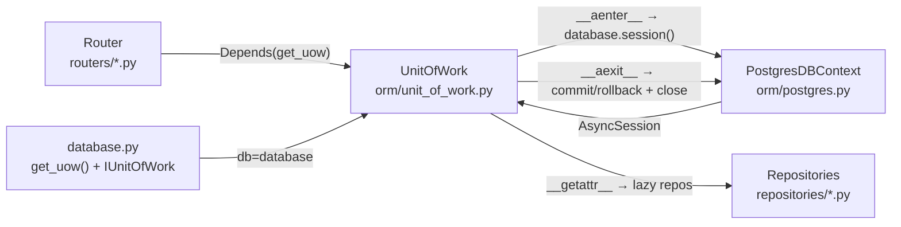

# Unit of Work — Flow & Logic Notes

> Architecture and logic notes for the Unit of Work pattern in the Book Management project.
> Covers how one HTTP request maps to one DB transaction, how repositories are created lazily, and how commit/rollback happen automatically.

---

## 1. Architecture Overview

`UnitOfWork` sits between the HTTP layer and the DB — it owns the session and the transaction for a single request:

### Core principles

- **1 request = 1 `UnitOfWork` = 1 `AsyncSession` = 1 transaction.** `get_uow()` is a FastAPI dependency, so every request gets a fresh `UnitOfWork`.
- The router/service **never** open, commit, or close a session themselves — they only use `uow.<repo>`. `UnitOfWork` handles the whole transaction lifecycle.
- `__aenter__` opens a new session via `database.session()`; `__aexit__` commits on success, rolls back on error, and **always** closes the session.
- Repositories are created **lazily** through `__getattr__` and cached in `_repos` — a repo is built only when first accessed, and reused within the same request.
- `IUnitOfWork` (Protocol) exists only for IDE/type-checking — it declares what `uow.books`, `uow.users`, ... are, so autocomplete and static checks work without runtime cost.
- The session itself comes from the **single shared** `PostgresDBContext` (`db_orm.md`), while `UnitOfWork` decides *when* to commit/rollback.

---

## 2. File Map

Only the files directly involved in the Unit of Work pattern:

| Layer | File | Role |
|---|---|---|
| ORM | `app/orm/unit_of_work.py` | `UnitOfWork` class — opens the session, creates repos lazily, commits/rolls back/close on exit |
| DB | `app/db/database.py` | `get_uow()` factory, `IUnitOfWork` Protocol, and the shared `database` instance |
| API | `app/api/deps.py` | Usage example: `get_current_user` uses `Depends(get_uow)` + `async with uow` |
| Router | `app/routers/book_router.py` | Usage example: endpoints declare `uow: IUnitOfWork = Depends(get_uow)` |
| Service | `app/services/book_service.py` | Usage example: `uow.books.get_by_id(...)`, `uow.books.add(...)` |

> The session source (`orm/postgres.py`) and the base repository (`orm/repository.py`) are covered in `db_orm.md`, not repeated here.

### Where each piece lives

- **`UnitOfWork`** (`orm/unit_of_work.py`): `__init__`, `__aenter__`, `__getattr__`, `__aexit__`, `commit()`, `rollback()`.
- **`get_uow()`** (`db/database.py`): builds a new `UnitOfWork` with the shared `database` and the full `repositories` mapping.
- **`IUnitOfWork`** (`db/database.py`): Protocol declaring every available repo attribute + `commit`/`rollback`.
