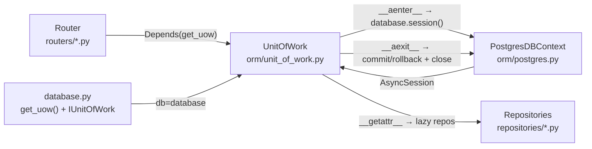
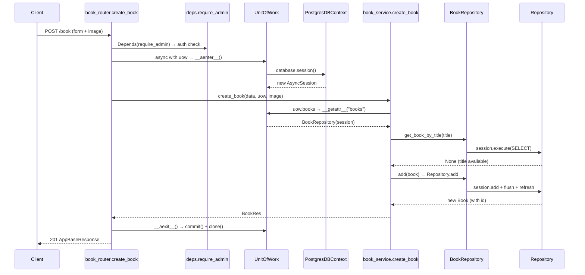

# Unit of Work — Flow & Logic Notes

> Architecture and logic notes for the Unit of Work pattern in the Book Management project.
> Covers how one HTTP request maps to one DB transaction, how repositories are created lazily, and how commit/rollback happen automatically.

---

## 1. Architecture Overview

`UnitOfWork` sits between the HTTP layer and the DB — it owns the session and the transaction for a single request:



### Core principles

- **1 request = 1 `UnitOfWork` = 1 `AsyncSession` = 1 transaction.** `get_uow()` is a FastAPI dependency, so every request gets a fresh `UnitOfWork`.
- The router/service **never** open, commit, or close a session themselves — they only use `uow.<repo>`. `UnitOfWork` handles the whole transaction lifecycle.
- `__aenter__` opens a new session via `database.session()`; `__aexit__` commits on success, rolls back on error, and **always** closes the session.
- Repositories are created **lazily** through `__getattr__` and cached in `_repos` — a repo is built only when first accessed, and reused within the same request.
- `IUnitOfWork` (Protocol) exists only for IDE/type-checking — it declares what `uow.books`, `uow.users`, ... are, so autocomplete and static checks work without runtime cost.
- The session itself comes from the **single shared** `PostgresDBContext` (`db_orm.md`), while `UnitOfWork` decides *when* to commit/rollback.

---

## 2. File Map

Only the files directly involved in the Unit of Work pattern:

| Layer | File | Role |
|---|---|---|
| ORM | `app/orm/unit_of_work.py` | `UnitOfWork` class — opens the session, creates repos lazily, commits/rolls back/close on exit |
| DB | `app/db/database.py` | `get_uow()` factory, `IUnitOfWork` Protocol, and the shared `database` instance |
| API | `app/api/deps.py` | Usage example: `get_current_user` uses `Depends(get_uow)` + `async with uow` |
| Router | `app/routers/book_router.py` | Usage example: endpoints declare `uow: IUnitOfWork = Depends(get_uow)` |
| Service | `app/services/book_service.py` | Usage example: `uow.books.get_by_id(...)`, `uow.books.add(...)` |

> The session source (`orm/postgres.py`) and the base repository (`orm/repository.py`) are covered in `db_orm.md`, not repeated here.

### Where each piece lives

- **`UnitOfWork`** (`orm/unit_of_work.py`): `__init__`, `__aenter__`, `__getattr__`, `__aexit__`, `commit()`, `rollback()`.
- **`get_uow()`** (`db/database.py`): builds a new `UnitOfWork` with the shared `database` and the full `repositories` mapping.
- **`IUnitOfWork`** (`db/database.py`): Protocol declaring every available repo attribute + `commit`/`rollback`.

---

## 3. How `UnitOfWork` works

The whole class is small — each method has one clear job. Below is the real code with an explanation per method.

### 3.1 `__init__` — store, don't connect

```python
def __init__(self, db, repositories):
    self._db = db                # the shared PostgresDBContext
    self._repo_factories = repositories  # {"books": BookRepository, ...}
    self.session = None          # no session yet
    self._repos = {}             # cache for created repos
```

- Nothing happens yet — no session, no repo. Just keeps the "ingredients" for later.
- `db` is the single shared `PostgresDBContext` from `database.py`.
- `repositories` is the dict `name → repo class` passed by `get_uow()`.

### 3.2 `__aenter__` — open the session (start of `async with uow`)

```python
async def __aenter__(self):
    self.session = await self._db.session()   # new AsyncSession
    self._repos = {}                          # clear cache for this request
    return self
```

- FastAPI triggers this when code enters `async with uow:`.
- Opens a **new** `AsyncSession` for this request (via `PostgresDBContext.session()`).
- Clears `_repos` so the next request starts with an empty cache.

### 3.3 `__getattr__` — create repos lazily

```python
def __getattr__(self, name):
    if name in self._repo_factories:
        if name not in self._repos:
            self._repos[name] = self._repo_factories[name](self.session)
        return self._repos[name]
    raise AttributeError(name)
```

- Called automatically only when an attribute is **missing** — i.e. `uow.books`.
- First access → creates `BookRepository(self.session)` and caches it in `_repos`.
- Next access (`uow.books` again) → returns the cached instance (same repo, same session).
- Why lazy? A request using only `books` never creates `users`, `payment`, ... — saves work and keeps one repo instance per request.

### 3.4 `__aexit__` — commit / rollback / close (end of `async with uow`)

```python
async def __aexit__(self, exc_type, exc, tb):
    try:
        if exc:
            await self.session.rollback()
        else:
            await self.session.commit()
    finally:
        await self.session.close()
```

- FastAPI triggers this when leaving `async with uow:`.
- `exc` is the exception raised inside the block (or `None`):
  - `exc is None` → success → `commit()`.
  - `exc is not None` → failure → `rollback()`.
- `finally` guarantees the session is **always** closed, success or not.

### 3.5 `commit()` / `rollback()` — manual control

```python
async def commit(self):
    await self.session.commit()

async def rollback(self):
    await self.session.rollback()
```

- Used when the service needs to control the transaction explicitly instead of waiting for `__aexit__`.
- Most flows rely on the automatic behavior in `__aexit__`; these methods exist for edge cases.

---

## 4. Example — `POST /book` (file-by-file trace)

A write flow that shows the full transaction lifecycle: multiple repo calls inside one `async with uow`, ending with an automatic commit.

### Request

```http
POST /book HTTP/1.1
Authorization: Bearer <access_token>
Content-Type: multipart/form-data

title=Clean Code&author_id=...&category_id=...&price=49.9&quantity=10
```

### Sequence



### File-by-file trace

1. **`app/routers/book_router.py`** — `create_book`
   - Declares `uow: IUnitOfWork = Depends(get_uow)` and `admin=Depends(require_admin)`, then enters `async with uow:`.

2. **`app/api/deps.py`** — `require_admin` → `get_current_user`
   - Auth runs first; `get_current_user` itself opens/closes **its own** `uow` to load the user.

3. **`app/db/database.py`** — `get_uow()`
   - Returns a fresh `UnitOfWork(db=database, repositories={...})`.

4. **`app/orm/unit_of_work.py`** — `UnitOfWork.__aenter__`
   - `self.session = await self._db.session()` → new `AsyncSession`.

5. **`app/orm/postgres.py`** — `PostgresDBContext.session()`
   - `return self._sessionmaker()` → a new session from the pool.

6. **`app/services/book_service.py`** — `create_book`
   - `await uow.books.get_book_by_title(book_data.title)` (duplicate check).

7. **`app/orm/unit_of_work.py`** — `__getattr__("books")`
   - Creates and caches `BookRepository(self.session)`.

8. **`app/repositories/book_repository.py`** — `get_book_by_title`
   - `session.execute(select(Book).where(...))` → returns `None` (title available).

9. **`app/services/book_service.py`** — continues
   - `book = req_to_book(book_data)`; `new_book = await uow.books.add(book)`.
   - `add` is inherited from `Repository` (`orm/repository.py`): `session.add` + `flush` + `refresh` — the row is now **staged** in the session (not yet committed).

10. **`app/services/book_service.py`** — optional image upload
    - Uploads the cover to MinIO (no DB involved); sets `new_book.cover_image`.

11. **`app/services/book_service.py`** — returns `book_to_res(new_book)`; router wraps it into `AppBaseResponse` (HTTP 201).

12. **`app/orm/unit_of_work.py`** — `__aexit__`
    - No exception escaped the block → `await self.session.commit()` writes the new book, then `finally` closes the session.

### What if something fails?

- `__aexit__` receives the exception only if it **escapes the `async with` block**.
- Example: `book_service.create_book` raises `ValueError` for a duplicate title, but the router catches it *inside* the block and returns `Error400` — so no rollback occurs (and nothing was written anyway).
- An **uncaught** exception (e.g. a DB error) would propagate out of `async with` → `__aexit__` calls `rollback()` and discards every staged change.
